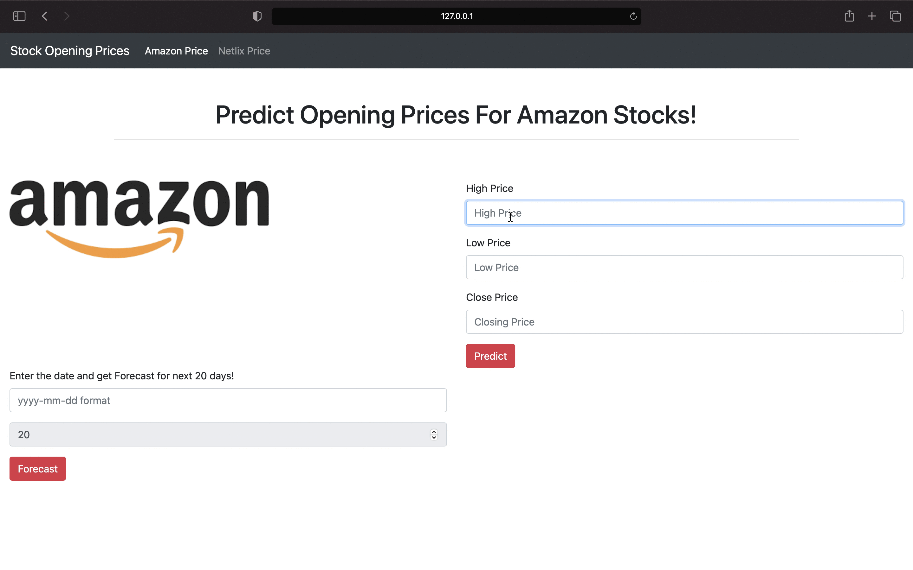

# Stock Price Prediction :

This Repo is end to end project that predicts opening stock prices for Amazon and Netflix. Also it forecast opening stock prices for next 20 days.

It contains EDA of the csv files.\
model_codes_jupyter : Contains jupyter file of the models created.\
MAIN_API : Contains flask application that combines both Amazon and Netflix API.

# Dataset :
Kaggle Dataset Reference : https://www.kaggle.com/aayushmishra1512/faang-complete-stock-data?select=Netflix.csv
## Used
1. [Amazon](https://github.com/adshre/End2EndProjects_LinearRegression/blob/master/Data/Amazon.csv): Amazon Dataset
2. [Netflix](https://github.com/adshre/End2EndProjects_LinearRegression/blob/master/Data/Netflix.csv): Netflix Dataset

# Libraries Used :
 1. Sci-kit Learn
 2. Flask
 3. Joblib
 4. Pandas
 5. Numpy
 6. Bootstrap
 7. HTML & CSS

# complete application video  : https://github.com/adshre/End2EndProjects_LinearRegression/blob/master/StockPrediction.mov

# Created By :
Aditi .D. Telang

### References : 
https://medium.com/@ranaprathap/learning-ml-with-andrew-part-1-linear-regression-with-a-single-variable-615f2d163b88
https://blog.ruanbekker.com/blog/2018/12/09/python-flask-tutorial-series-setup-a-python-virtual-environment-p2/
https://topherpedersen.blog/2019/12/28/how-to-setup-a-new-flask-app-on-a-mac/
https://www.kaggle.com/jagannathrk/extensive-eda-analysis-on-tesla-stock-data
https://github.com/Devansharma/Health-App/blob/main/README.md

and many more :)
